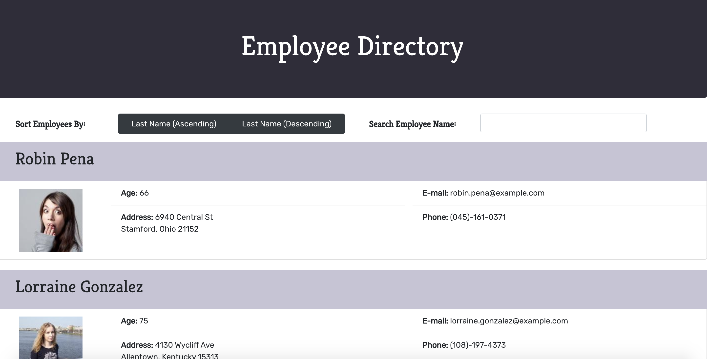
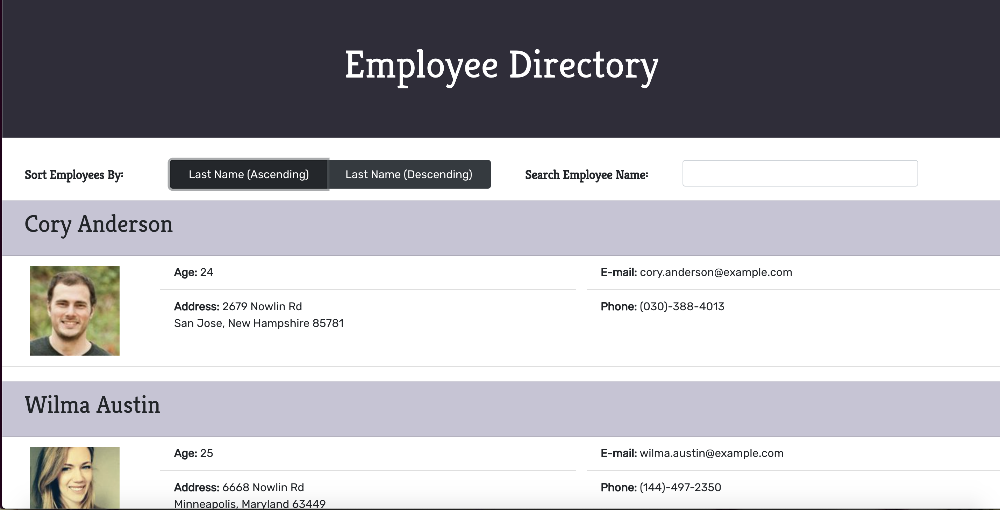
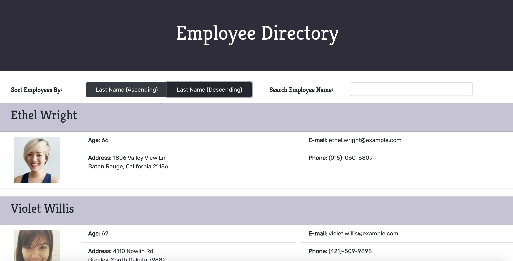
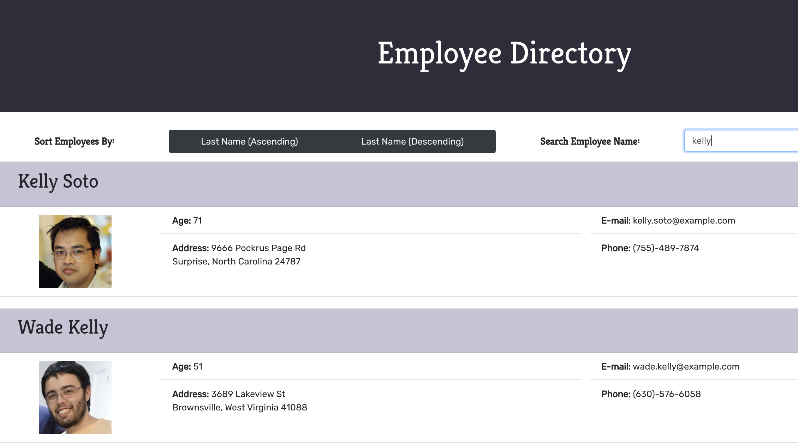

# Employee Directory

> As an employer, one may want to view their entire list of employees at once. This Employee Directory application uses React.js to import a directory of employees and their information, as well as allows the user to sort the employees by last name and search the employees by name in their database.

## Table of Contents

* [Description](#description)
* [Screenshots](#screenshots)
* [License](#license)
* [Questions](#questions)

## Description

The Employee Directory application imports a directory of 200 users and displays their information on the page: this information includes their first and last names, photos, age, address, e-mail address, and phone number. While the employees are initially listed in a random order, users can click the buttons to sort the employees by last name, either ascending (alphabetical order) or descending (reverse alphabetical order). Users can also search the employees by name by typing into the search bar, which will update in real time according to the user's search keywords. This app uses React.js, Axios, and Bootstrap CSS Framework in order to operate.

## Screenshots

Home Page

Employee Directory with employees sorted by last name in ascending order

Employee Directory with employees sorted by last name in ascending order

The search function at work

## License

Copyright 2020 Maria Waslick

Permission is hereby granted, free of charge, to any person obtaining a copy of this software and associated documentation files (the "Software"), to deal in the Software without restriction, including without limitation the rights to use, copy, modify, merge, publish, distribute, sublicense, and/or sell copies of the Software, and to permit persons to whom the Software is furnished to do so, subject to the following conditions:

The above copyright notice and this permission notice shall be included in all copies or substantial portions of the Software.

THE SOFTWARE IS PROVIDED "AS IS", WITHOUT WARRANTY OF ANY KIND, EXPRESS OR IMPLIED, INCLUDING BUT NOT LIMITED TO THE WARRANTIES OF MERCHANTABILITY, FITNESS FOR A PARTICULAR PURPOSE AND NONINFRINGEMENT. IN NO EVENT SHALL THE AUTHORS OR COPYRIGHT HOLDERS BE LIABLE FOR ANY CLAIM, DAMAGES OR OTHER LIABILITY, WHETHER IN AN ACTION OF CONTRACT, TORT OR OTHERWISE, ARISING FROM, OUT OF OR IN CONNECTION WITH THE SOFTWARE OR THE USE OR OTHER DEALINGS IN THE SOFTWARE.

## Questions

If you have additional questions, you can contact me through my [GitHub Profile](https://github.com/mwaslick), or e-mail me at mariawaslick@gmail.com.